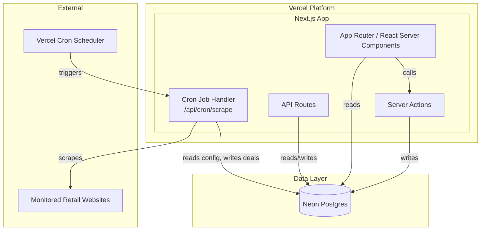
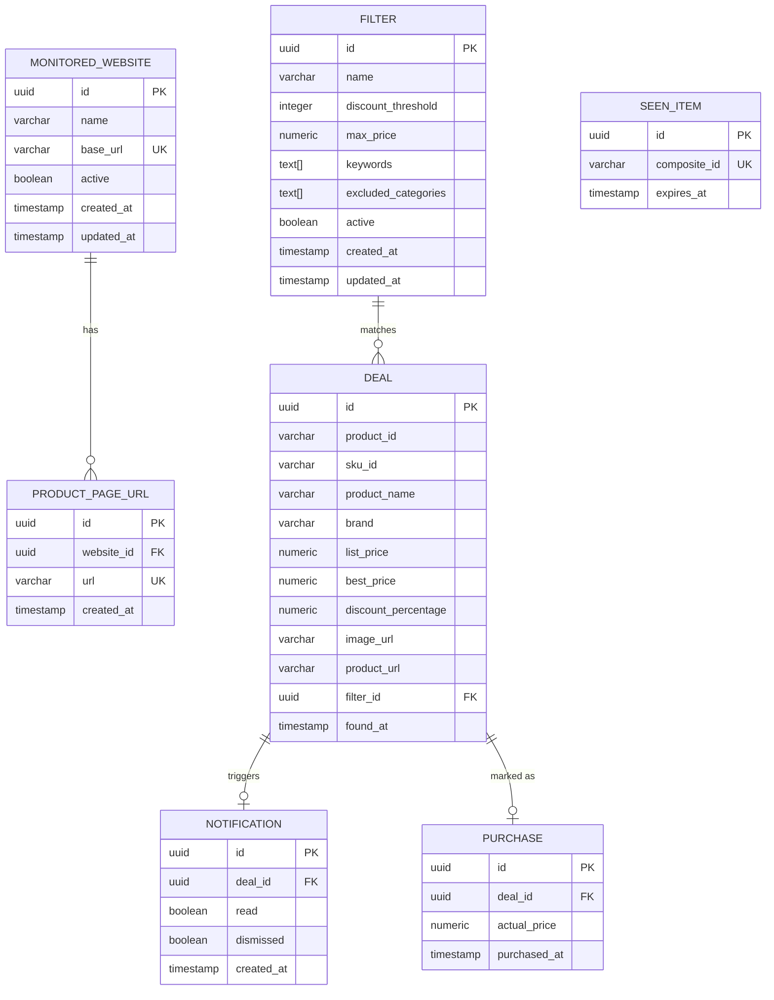

# Design Document: Deal Monitor Webapp

## Overview

Deal Monitor is a full-stack Next.js application deployed on Vercel with a Neon Postgres database. The system provides a web-based interface for configuring website monitoring, managing deal filters, viewing discovered deals, receiving notifications, and tracking purchase metrics. A scheduled scraping engine runs as Vercel Cron Jobs, fetching product data from configured URLs, evaluating deals against user-defined filters, and generating in-app notifications for qualifying deals.

The architecture follows Next.js App Router conventions with server components for data fetching, server actions for mutations, and API routes for the cron-triggered scraping pipeline. The UI uses Tailwind CSS with DaisyUI for a dark cyberpunk-themed responsive interface.

## Architecture



### Key Architectural Decisions

1. **Next.js App Router**: Server components for data-heavy pages (dashboard, lists), client components for interactive elements (forms, notification panel). Server actions handle all mutations.
2. **Vercel Cron Jobs**: The scraping pipeline runs as a cron-triggered API route (`/api/cron/scrape`). Vercel Cron supports intervals down to 1 minute on Pro plans.
3. **Neon Postgres via Drizzle ORM**: Drizzle provides type-safe schema definitions, migrations, and query building. Neon's serverless driver works well with Vercel's edge/serverless functions.
4. **No external notification services**: Notifications are purely in-app, stored in Postgres, and rendered in the UI. Discord integration could be added later as an optional channel.
5. **Rate limiting and retry logic**: Built into the scraper service layer, not at the framework level. Configurable per-website.

## Components and Interfaces

### 1. Database Layer (`src/db/`)

- **`schema.ts`**: Drizzle ORM schema definitions for all tables (monitored_websites, product_page_urls, filters, deals, seen_items, notifications, purchases)
- **`index.ts`**: Neon database client initialization and Drizzle instance export
- **`migrations/`**: Drizzle migration files

### 2. Scraper Engine (`src/lib/scraper/`)

- **`scraper.ts`**: Core scraping orchestrator. Fetches URLs, delegates to parsers, applies filters, manages seen-item tracking.
  ```typescript
  interface ScrapeResult {
    totalProductsEncountered: number;
    newDealsFound: number;
    durationMs: number;
    errors: ScrapeError[];
  }

  async function executeScrapeJob(): Promise<ScrapeResult>
  ```

- **`parser.ts`**: HTML/JSON parsing for product data extraction. Handles Next.js `__NEXT_DATA__` extraction, listing pages with pagination, and individual product pages.
  ```typescript
  interface ProductVariant {
    productId: string;
    skuId: string | null;
    displayName: string;
    brand: string | null;
    listPrice: number;
    activePrice: number | null;
    salePrice: number | null;
    bestPrice: number;
    discountPercentage: number;
    imageUrl: string | null;
    productUrl: string;
    categories: string[];
    inStock: boolean;
  }

  function parseNextData(html: string): NextDataPayload | null
  function extractProductVariants(payload: NextDataPayload): ProductVariant[]
  ```

- **`http-client.ts`**: HTTP fetching with rate limiting, retry with exponential backoff, and configurable timeouts.
  ```typescript
  interface HttpClientConfig {
    rateLimit: number;       // min ms between requests
    maxRetries: number;
    backoffBase: number;
    backoffMax: number;
    timeout: number;
  }

  async function fetchWithRetry(url: string, config: HttpClientConfig): Promise<Response | null>
  ```

### 3. Filter Engine (`src/lib/filter-engine.ts`)

Evaluates product variants against user-defined filters.

```typescript
interface FilterCriteria {
  discountThreshold: number;    // 1-99
  maxPrice: number | null;
  keywords: string[];
  excludedCategories: string[];
}

function evaluateVariant(variant: ProductVariant, filter: FilterCriteria): boolean
function findMatchingFilters(variant: ProductVariant, filters: FilterCriteria[]): FilterCriteria[]
```

### 4. Seen Item Tracker (`src/lib/seen-tracker.ts`)

Manages duplicate detection with TTL-based expiry.

```typescript
function computeCompositeId(productId: string, skuId: string | null): string
function isNewDeal(compositeId: string): Promise<boolean>
function markAsSeen(compositeId: string, ttlDays: number): Promise<void>
function cleanExpiredItems(): Promise<number>
```

### 5. Notification Service (`src/lib/notification-service.ts`)

Creates and manages in-app notifications.

```typescript
interface NotificationPayload {
  dealId: string;
  productName: string;
  brand: string | null;
  listPrice: number;
  bestPrice: number;
  discountPercentage: number;
  imageUrl: string | null;
  productUrl: string;
}

function createNotification(payload: NotificationPayload): Promise<void>
function getUnreadCount(): Promise<number>
function markAsRead(notificationId: string): Promise<void>
function dismiss(notificationId: string): Promise<void>
```

### 6. Metrics Service (`src/lib/metrics-service.ts`)

Computes dashboard metrics from deal and purchase data.

```typescript
interface DashboardMetrics {
  totalDealsFound: number;
  totalItemsPurchased: number;
  totalDollarsSaved: number;
}

function getDashboardMetrics(): Promise<DashboardMetrics>
function getRecentDeals(limit: number): Promise<Deal[]>
```

### 7. API Routes

- **`/api/cron/scrape`** (GET): Cron-triggered scrape endpoint. Secured with `CRON_SECRET` header verification.
- **Server Actions** in `src/app/` for all CRUD operations (websites, URLs, filters, notifications, purchases).

### 8. UI Pages (`src/app/`)

| Route | Description |
|---|---|
| `/` | Dashboard with metrics cards and recent deals |
| `/websites` | Monitored websites list + add/edit forms |
| `/websites/[id]` | Website detail with associated product page URLs |
| `/filters` | Filter list + add/edit forms |
| `/notifications` | Notification panel with read/dismiss actions |
| `/settings` | Scrape interval, TTL, rate limit configuration |

## Data Models

### Entity Relationship Diagram



### Drizzle Schema (TypeScript)

```typescript
import { pgTable, uuid, varchar, boolean, timestamp, numeric, text, integer, uniqueIndex } from 'drizzle-orm/pg-core';

export const monitoredWebsites = pgTable('monitored_websites', {
  id: uuid('id').defaultRandom().primaryKey(),
  name: varchar('name', { length: 255 }).notNull(),
  baseUrl: varchar('base_url', { length: 2048 }).notNull().unique(),
  active: boolean('active').default(true).notNull(),
  createdAt: timestamp('created_at').defaultNow().notNull(),
  updatedAt: timestamp('updated_at').defaultNow().notNull(),
});

export const productPageUrls = pgTable('product_page_urls', {
  id: uuid('id').defaultRandom().primaryKey(),
  websiteId: uuid('website_id').references(() => monitoredWebsites.id, { onDelete: 'cascade' }).notNull(),
  url: varchar('url', { length: 2048 }).notNull(),
  createdAt: timestamp('created_at').defaultNow().notNull(),
}, (table) => ({
  uniqueUrl: uniqueIndex('unique_url_per_website').on(table.websiteId, table.url),
}));

export const filters = pgTable('filters', {
  id: uuid('id').defaultRandom().primaryKey(),
  name: varchar('name', { length: 255 }).notNull(),
  discountThreshold: integer('discount_threshold').notNull(),
  maxPrice: numeric('max_price', { precision: 10, scale: 2 }),
  keywords: text('keywords').array(),
  excludedCategories: text('excluded_categories').array(),
  active: boolean('active').default(true).notNull(),
  createdAt: timestamp('created_at').defaultNow().notNull(),
  updatedAt: timestamp('updated_at').defaultNow().notNull(),
});

export const deals = pgTable('deals', {
  id: uuid('id').defaultRandom().primaryKey(),
  productId: varchar('product_id', { length: 255 }).notNull(),
  skuId: varchar('sku_id', { length: 255 }),
  productName: varchar('product_name', { length: 512 }).notNull(),
  brand: varchar('brand', { length: 255 }),
  listPrice: numeric('list_price', { precision: 10, scale: 2 }).notNull(),
  bestPrice: numeric('best_price', { precision: 10, scale: 2 }).notNull(),
  discountPercentage: numeric('discount_percentage', { precision: 5, scale: 2 }).notNull(),
  imageUrl: varchar('image_url', { length: 2048 }),
  productUrl: varchar('product_url', { length: 2048 }).notNull(),
  filterId: uuid('filter_id').references(() => filters.id),
  foundAt: timestamp('found_at').defaultNow().notNull(),
});

export const seenItems = pgTable('seen_items', {
  id: uuid('id').defaultRandom().primaryKey(),
  compositeId: varchar('composite_id', { length: 512 }).notNull().unique(),
  expiresAt: timestamp('expires_at').notNull(),
});

export const notifications = pgTable('notifications', {
  id: uuid('id').defaultRandom().primaryKey(),
  dealId: uuid('deal_id').references(() => deals.id, { onDelete: 'cascade' }).notNull(),
  read: boolean('read').default(false).notNull(),
  dismissed: boolean('dismissed').default(false).notNull(),
  createdAt: timestamp('created_at').defaultNow().notNull(),
});

export const purchases = pgTable('purchases', {
  id: uuid('id').defaultRandom().primaryKey(),
  dealId: uuid('deal_id').references(() => deals.id).notNull(),
  actualPrice: numeric('actual_price', { precision: 10, scale: 2 }).notNull(),
  purchasedAt: timestamp('purchased_at').defaultNow().notNull(),
});
```


## Correctness Properties

*A property is a characteristic or behavior that should hold true across all valid executions of a system — essentially, a formal statement about what the system should do. Properties serve as the bridge between human-readable specifications and machine-verifiable correctness guarantees.*

### Property 1: Website CRUD round-trip

*For any* valid website name and base URL, creating a Monitored_Website and then fetching it by ID should return a record with the same name, base URL, and active status. Furthermore, updating any field and re-fetching should reflect the updated values.

**Validates: Requirements 1.1, 1.2**

### Property 2: Website cascade delete

*For any* Monitored_Website with one or more associated Product_Page_URLs, deleting the website should result in both the website and all its associated URLs being absent from the database.

**Validates: Requirements 1.3**

### Property 3: Website base URL uniqueness

*For any* base URL that already exists in the database, attempting to create another Monitored_Website with the same base URL should be rejected.

**Validates: Requirements 1.5**

### Property 4: Product page URL domain validation

*For any* Product_Page_URL whose domain does not match the associated Monitored_Website's base URL domain, the submission should be rejected. Conversely, for any URL whose domain matches, the submission should succeed.

**Validates: Requirements 2.1, 2.4**

### Property 5: Product page URL uniqueness per website

*For any* Product_Page_URL already associated with a Monitored_Website, attempting to add the same URL to the same website should be rejected.

**Validates: Requirements 2.5**

### Property 6: Filter CRUD round-trip

*For any* valid filter configuration (name, discount threshold 1-99, optional max price >= 0, optional keywords, optional excluded categories), creating a Filter and then fetching it by ID should return a record with identical field values. Updating any field and re-fetching should reflect the updated values.

**Validates: Requirements 3.1, 3.2**

### Property 7: Filter validation rejects invalid thresholds and prices

*For any* discount threshold value outside the range 1-99, filter creation should be rejected. *For any* negative max price value, filter creation should be rejected.

**Validates: Requirements 3.5, 3.6**

### Property 8: Discount percentage computation

*For any* listPrice > 0 and set of candidate prices (activePrice, salePrice) where at least one candidate is present, the computed Discount_Percentage should equal `((listPrice - min(candidates)) / listPrice) * 100`, rounded to two decimal places.

**Validates: Requirements 4.3**

### Property 9: Seen item tracking round-trip

*For any* composite identifier (productId + optional skuId), marking it as seen with a future TTL and then checking `isNewDeal` should return false. For any composite identifier not previously marked (or with expired TTL), `isNewDeal` should return true.

**Validates: Requirements 5.1, 5.2, 5.3**

### Property 10: Composite ID format

*For any* productId and optional skuId, `computeCompositeId(productId, skuId)` should return `"productId:skuId"` when skuId is present and non-null, and `"productId"` when skuId is null or absent.

**Validates: Requirements 5.5**

### Property 11: Filter engine — discount threshold qualification

*For any* product variant and filter, the variant qualifies if and only if its discountPercentage is greater than or equal to the filter's discount threshold.

**Validates: Requirements 7.1**

### Property 12: Filter engine — max price disqualification

*For any* product variant and filter with a max price specified, the variant is disqualified if its bestPrice exceeds the filter's max price.

**Validates: Requirements 7.2**

### Property 13: Filter engine — keyword matching

*For any* product variant and filter with keywords specified, the variant qualifies only if the product name contains at least one keyword (case-insensitive comparison).

**Validates: Requirements 7.3**

### Property 14: Filter engine — category exclusion

*For any* product variant with categories and filter with excluded categories, the variant is disqualified if any of its categories matches an excluded category (case-insensitive comparison).

**Validates: Requirements 7.4**

### Property 15: Filter engine — multi-filter aggregation

*For any* product variant and set of active filters, the variant is marked as a Deal if and only if it qualifies against at least one filter (considering all filter dimensions: threshold, max price, keywords, category exclusions).

**Validates: Requirements 7.5**

### Property 16: Savings computation

*For any* set of purchases where each purchase has an associated deal with listPrice and bestPrice, the total dollars saved should equal the sum of `(listPrice - bestPrice)` across all purchases. Adding a new purchase should increase the total by exactly `(listPrice - bestPrice)` of the new purchase's deal.

**Validates: Requirements 8.3, 8.5**

### Property 17: Notification state transitions

*For any* unread notification, marking it as read should result in `read = true` when re-fetched. *For any* notification, dismissing it should result in `dismissed = true` and the notification should not appear in the active (non-dismissed) notification list.

**Validates: Requirements 6.3, 6.4**

### Property 18: Notification creation contains required fields

*For any* deal, the created notification should reference the deal and the deal record should contain product name, brand, list price, best price, discount percentage, image URL, and product URL.

**Validates: Requirements 6.1**

### Property 19: Price precision round-trip

*For any* price value with up to two decimal places, storing it in the database and retrieving it should produce an identical numeric value (no floating-point drift).

**Validates: Requirements 11.8**

## Error Handling

### HTTP Errors During Scraping
- **429/403/503 responses**: Retry with exponential backoff (configurable base, max, and retry count). Log each retry attempt.
- **Network failures / timeouts**: Catch exceptions, log the error, skip the URL, and continue with remaining URLs.
- **Invalid HTML / missing `__NEXT_DATA__`**: Log a warning and skip the page. Do not crash the scrape job.

### Input Validation Errors
- **Invalid website URL format**: Return a validation error to the UI with a descriptive message.
- **Duplicate base URL / product page URL**: Return a conflict error with a message indicating the duplicate.
- **Invalid filter parameters**: Return validation errors specifying which fields are invalid and why.
- **Domain mismatch on product page URL**: Return a validation error indicating the URL does not belong to the website's domain.

### Database Errors
- **Connection failures**: Neon's serverless driver handles connection pooling. On transient failures, the operation should be retried once. On persistent failure, return a 500 error to the client.
- **Constraint violations**: Catch unique constraint violations and return user-friendly error messages (e.g., "A website with this URL already exists").

### Cron Job Errors
- **Concurrent execution**: Use a database-level advisory lock or a `scrape_jobs` status table to prevent concurrent runs. If a lock cannot be acquired, skip the run and log a warning.
- **Timeout**: Vercel serverless functions have execution time limits (10s on Hobby, 60s on Pro). For large scrape jobs, process URLs in batches across multiple cron invocations if needed.

### Notification Errors
- **Missing deal reference**: If a deal is deleted while a notification exists, the cascade delete on the foreign key handles cleanup.

## Testing Strategy

### Testing Framework

- **Unit & Integration Tests**: Vitest (fast, TypeScript-native, compatible with Next.js)
- **Property-Based Tests**: fast-check (JavaScript/TypeScript PBT library, integrates with Vitest)
- **Database Tests**: Use a test Neon database or Postgres container for integration tests

### Unit Tests

Unit tests cover specific examples, edge cases, and error conditions:

- Filter validation edge cases (threshold = 0, 100, -1, 99, null)
- Discount computation with zero prices, equal prices, missing prices
- Composite ID generation with empty strings, special characters
- URL domain matching with subdomains, paths, query strings
- Notification state transitions (read → read again, dismiss → dismiss again)

### Property-Based Tests

Each correctness property maps to a single property-based test. Each test runs a minimum of 100 iterations with randomly generated inputs.

Each test is annotated with a comment referencing the design property:
```
// Feature: deal-monitor-webapp, Property N: <property title>
```

Property tests focus on:
- Filter engine evaluation (Properties 11-15): Generate random variants and filters, verify evaluation logic
- Discount computation (Property 8): Generate random price combinations, verify formula
- Composite ID format (Property 10): Generate random productId/skuId pairs, verify format
- Seen item tracking (Property 9): Generate random composite IDs, verify round-trip behavior
- Savings computation (Property 16): Generate random purchase sets, verify sum
- CRUD round-trips (Properties 1, 6): Generate random valid entities, verify persistence
- Validation rejection (Properties 3, 5, 7): Generate invalid inputs, verify rejection
- Price precision (Property 19): Generate random decimal values, verify round-trip precision

### Test Organization

```
src/
  lib/
    __tests__/
      filter-engine.test.ts          # Unit + Property tests for filter evaluation
      filter-engine.property.test.ts  # Property-only tests (Properties 11-15)
      seen-tracker.test.ts            # Unit + Property tests (Properties 9, 10)
      discount.test.ts                # Unit + Property tests (Property 8)
      metrics.test.ts                 # Unit + Property tests (Property 16)
      price-precision.test.ts         # Property test (Property 19)
  app/
    __tests__/
      websites.test.ts               # Integration tests (Properties 1-3)
      urls.test.ts                    # Integration tests (Properties 4-5)
      filters.test.ts                 # Integration tests (Properties 6-7)
      notifications.test.ts           # Integration tests (Properties 17-18)
```
