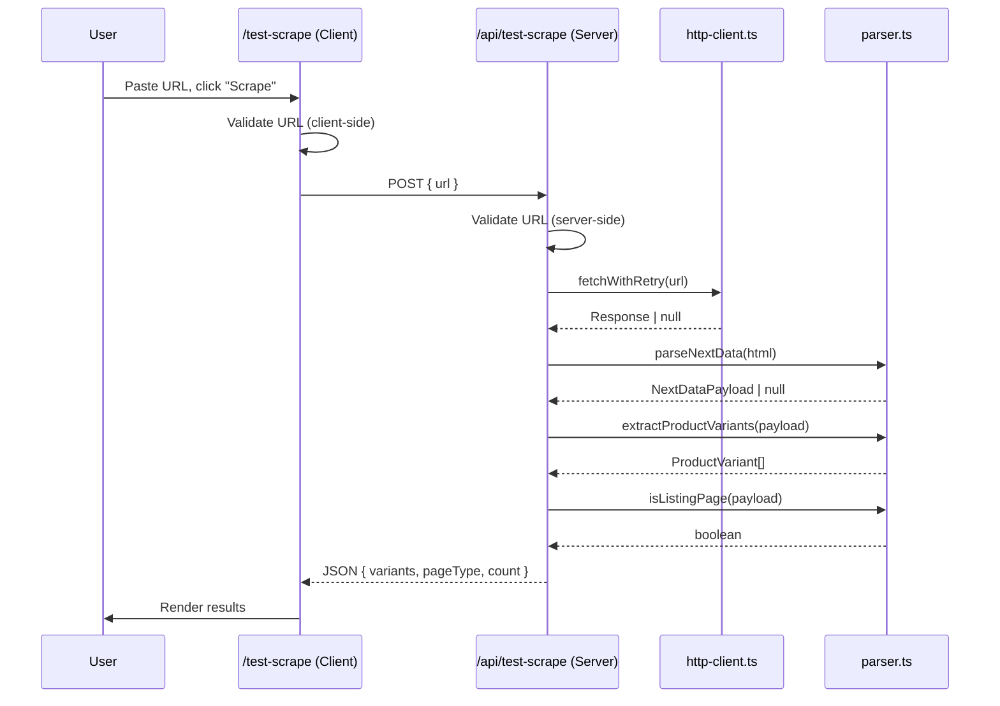

# Design Document: Scrape Tester

## Overview

The Scrape Tester feature adds a `/test-scrape` page and a supporting API route (`/api/test-scrape`) to the Deal Monitor app. The page provides a simple form where users paste a product page URL, trigger a one-off scrape, and see the parsed `ProductVariant` results rendered in a card layout. No data is persisted to the database — the feature reuses the existing `http-client` and `parser` modules in a stateless, read-only flow.

## Architecture



The feature introduces two new files and modifies one existing file:

| Change | File |
|--------|------|
| New API route | `src/app/api/test-scrape/route.ts` |
| New page (client component) | `src/app/test-scrape/page.tsx` |
| Modified | `src/components/sidebar-nav.tsx` (add nav item) |

## Components and Interfaces

### 1. API Route — `POST /api/test-scrape`

**Request body:**
```typescript
{ url: string }
```

**Success response (200):**
```typescript
{
  variants: ProductVariant[];
  pageType: 'listing' | 'product' | 'unknown';
  count: number;
}
```

**Error responses:**
- `400` — Invalid or missing URL
- `502` — Upstream fetch failed (HTTP client returned null)
- `422` — Page fetched but `__NEXT_DATA__` could not be parsed

Server-side validation: URL must be non-empty and start with `http://` or `https://`.

The route imports `fetchWithRetry` from `http-client.ts` and `parseNextData`, `extractProductVariants`, `isListingPage` from `parser.ts` directly — no database interaction.

### 2. Test Scrape Page — `/test-scrape`

A `'use client'` component with:
- A controlled text input for the URL
- A "Scrape" submit button
- Client-side validation (empty/whitespace check, protocol check)
- `fetch('/api/test-scrape', { method: 'POST', body })` call
- Loading state (disabled input + spinner)
- Error display (validation errors and API errors)
- Results display: summary bar + variant cards

### 3. Sidebar Navigation Update

Add a new entry to the `navItems` array in `sidebar-nav.tsx`:
```typescript
{
  href: '/test-scrape',
  label: 'Test Scrape',
  icon: <NavIcon d={ICON_PATHS.testScrape} />,
}
```

A magnifying-glass or beaker-style SVG path will be added to `ICON_PATHS`.

## Data Models

No new database tables or schema changes. The feature operates entirely on the existing `ProductVariant` type exported from `parser.ts`.

**API response shape** (new, defined inline in the route):

```typescript
interface TestScrapeResponse {
  variants: ProductVariant[];
  pageType: 'listing' | 'product' | 'unknown';
  count: number;
}

interface TestScrapeError {
  error: string;
}
```

**Client-side state:**

```typescript
interface ScrapeState {
  loading: boolean;
  error: string | null;
  result: TestScrapeResponse | null;
}
```


## Correctness Properties

*A property is a characteristic or behavior that should hold true across all valid executions of a system — essentially, a formal statement about what the system should do. Properties serve as the bridge between human-readable specifications and machine-verifiable correctness guarantees.*

### Property 1: Whitespace-only URLs are rejected

*For any* string composed entirely of whitespace characters (spaces, tabs, newlines, etc.), submitting it as the URL input should be rejected by the validation logic, and no API call should be made.

**Validates: Requirements 2.3**

### Property 2: Non-HTTP(S) URLs are rejected

*For any* string that does not start with `http://` or `https://`, submitting it as the URL input should be rejected by the validation logic, and no API call should be made.

**Validates: Requirements 2.4, 5.1**

### Property 3: Variant display completeness

*For any* `ProductVariant` object with non-null fields, the rendered variant card should contain the product name, brand, list price, best price, discount percentage, and stock status. Additionally, the results summary should display the correct total variant count and the page type.

**Validates: Requirements 4.1, 4.4**

## Error Handling

| Scenario | Layer | Behavior |
|----------|-------|----------|
| Empty / whitespace URL | Client | Show validation error, block submission |
| Non-HTTP(S) URL | Client | Show validation error, block submission |
| Server-side invalid URL | API (400) | Return `{ error: "..." }` |
| Upstream fetch failure | API (502) | Return `{ error: "Failed to fetch the URL" }` |
| Missing `__NEXT_DATA__` | API (422) | Return `{ error: "Could not parse product data from this page" }` |
| Network error calling API | Client | Show generic error message |
| Unexpected server error | API (500) | Return `{ error: "..." }`, client displays it |

## Testing Strategy

### Unit Tests

- Validate URL validation logic (empty, whitespace, missing protocol, valid URLs)
- Validate API route handler with mocked `fetchWithRetry` and parser functions
- Test error paths: fetch failure → 502, parse failure → 422, invalid body → 400

### Property-Based Tests

Library: `fast-check` (already installed in the project)

Each property test should run a minimum of 100 iterations.

- **Property 1** — Generate arbitrary whitespace strings, assert validation rejects all of them
  - Tag: **Feature: scrape-tester, Property 1: Whitespace-only URLs are rejected**
- **Property 2** — Generate arbitrary strings without `http://` or `https://` prefix, assert validation rejects all of them
  - Tag: **Feature: scrape-tester, Property 2: Non-HTTP(S) URLs are rejected**
- **Property 3** — Generate arbitrary `ProductVariant` objects, render them, assert all required fields appear in the output
  - Tag: **Feature: scrape-tester, Property 3: Variant display completeness**

### Test Organization

Tests will live in `src/lib/scraper/__tests__/` alongside existing scraper tests, with a new file `test-scrape.test.ts` for the validation logic and API handler tests.
